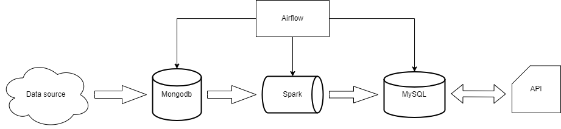

# Music_chart
A small project that collect data from spotify and soundcloud api and store them in mysql database 
# Setup
## Docker
The project require at least 8 Gb of RAM
```
docker compose build
docker compose up -d
```
## Airflow connections
- spotify_creds: get from https://developer.spotify.com/dashboard
```
Password field:
{
    "client_id": <client_id>,
    "client_secret": <client_secret>
}
```
- spark_conn
- mongo_conn
- mysql_conn
# Architecture
